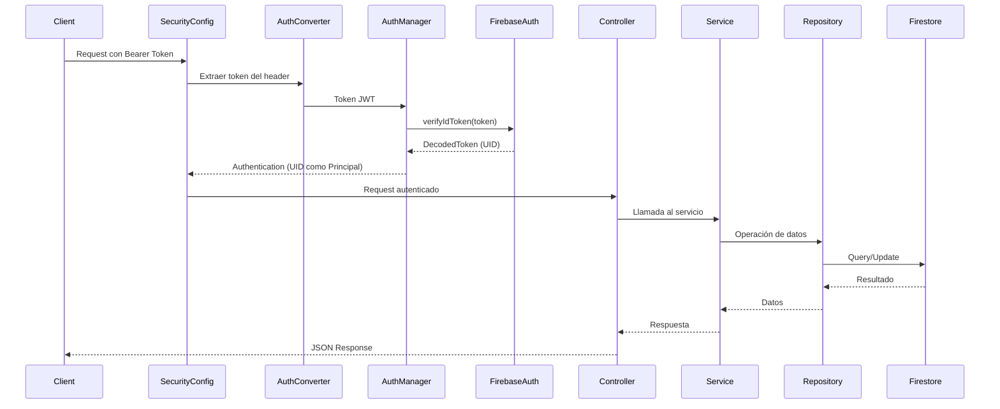
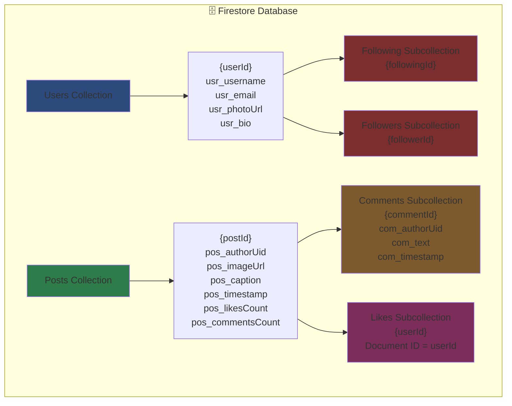

# 📸 UPSGlam 2.0 - Backend Reactivo con Spring WebFlux

## 📝 Descripción del Proyecto

Este repositorio contiene el **Backend Reactivo** de la plataforma social UPSGlam 2.0. Actúa como un **API Gateway** inteligente que orquesta la autenticación, el almacenamiento y el procesamiento de imágenes.

### 🚀 Arquitectura del Sistema

El sistema sigue una arquitectura de microservicios moderna:

1.  **Spring Boot (Este Repo):**
    *   Gestiona la autenticación con **Firebase**.
    *   Actúa como Gateway para el servicio de procesamiento.
    *   Sube las imágenes procesadas a **Supabase Storage**.
    *   Devuelve respuestas JSON estructuradas al cliente.
2.  **FastAPI (VisionProcessingGPU-Kit):**
    *   Microservicio externo en Python.
    *   Procesa imágenes usando **GPU (CUDA)** y OpenCV.
    *   Aplica filtros: Canny, Gaussian, Negative, Emboss, Watermark, Ripple, Collage.
    *   [Repositorio GitHub](https://github.com/Juanja1306/VisionProcessingGPU-Kit)
3.  **Firebase:**
    *   **Auth:** Gestión de usuarios y tokens JWT.
    *   **Firestore:** Persistencia de datos de usuario.
4.  **Supabase:**
    *   **Storage:** Almacenamiento de objetos para guardar las imágenes procesadas.

---

## 🏗️ Arquitectura del Backend

### Diagrama de Arquitectura General

```mermaid
graph TB
    subgraph Client["🌐 Cliente (Flutter/Postman)"]
        ClientRequest[Request HTTP]
    end

    subgraph Security["🔒 Capa de Seguridad"]
        SecurityConfig[SecurityConfig]
        AuthConverter[BearerTokenServerAuthenticationConverter]
        AuthManager[FirebaseAuthenticationManager]
        SecurityConfig --> AuthConverter
        SecurityConfig --> AuthManager
        AuthManager --> FirebaseAuth[Firebase Auth<br/>Verificar JWT]
    end

    subgraph Controllers["📡 Controladores (REST)"]
        AuthCtrl[AuthControllerImpl<br/>/api/auth]
        PostsCtrl[PostsControllerImpl<br/>/api/posts]
        CommentCtrl[CommentController<br/>/api/posts]
        LikeCtrl[LikeControllerImpl<br/>/api/posts]
        SubCtrl[SubscriptionController<br/>/api/users]
        UserCtrl[UserController<br/>/api/users]
        ImageCtrl[ImageProcessingController<br/>/api/process]
        DiscoveryCtrl[DiscoveryController<br/>/discovery]
    end

    subgraph Services["⚙️ Capa de Servicios"]
        AuthService[AuthServiceImpl]
        PostService[PostsServiceImpl]
        CommentService[CommentsServiceImpl]
        LikeService[LikeServiceImpl]
        SubService[SubscriptionServiceImpl]
        UserService[UserServiceImpl]
        ImageService[ImageProcessingService]
        SupabaseService[SupabaseStorageService]
    end

    subgraph Repositories["💾 Capa de Repositorios"]
        AuthRepo[AuthRepositoryImpl]
        PostRepo[PostRepositoryImpl]
        CommentRepo[CommentsRepositoryImpl]
        LikeRepo[LikeRepositoryImpl]
        SubRepo[SubscriptionRepositoryImpl]
        UserRepo[UserRepositoryImpl]
    end

    subgraph External["🌍 Servicios Externos"]
        FirebaseAuthExt[Firebase Auth API<br/>Login/Register]
        FirestoreDB[(Firestore Database<br/>Users, Posts, Comments,<br/>Likes, Subscriptions)]
        SupabaseStorage[Supabase Storage<br/>Imágenes]
        FastAPI[FastAPI Service<br/>Procesamiento GPU]
    end

    subgraph Config["⚙️ Configuración"]
        FirebaseConfig[FirebaseConfig<br/>FirebaseApp, Firestore, Auth]
        WebClientConfig[WebClientConfig<br/>fastApiWebClient<br/>firebaseAuthWebClient]
        ExceptionHandler[GlobalExceptionHandler<br/>Manejo de Errores]
    end

    %% Flujo de Request
    ClientRequest --> SecurityConfig
    SecurityConfig -->|"JWT válido"| Controllers

    %% Controllers a Services
    AuthCtrl --> AuthService
    PostsCtrl --> PostService
    CommentCtrl --> CommentService
    LikeCtrl --> LikeService
    SubCtrl --> SubService
    UserCtrl --> UserService
    ImageCtrl --> ImageService

    %% Services a Repositories
    AuthService --> AuthRepo
    PostService --> PostRepo
    PostService --> SupabaseService
    CommentService --> CommentRepo
    CommentService --> PostRepo
    LikeService --> LikeRepo
    LikeService --> PostRepo
    SubService --> SubRepo
    SubService --> UserRepo
    UserService --> UserRepo
    UserService --> SupabaseService

    %% Services a External
    ImageService --> FastAPI
    ImageService --> SupabaseService
    SupabaseService --> SupabaseStorage
    AuthRepo --> FirebaseAuthExt
    AuthRepo --> FirestoreDB

    %% Repositories a External
    PostRepo --> FirestoreDB
    PostRepo --> SupabaseService
    CommentRepo --> FirestoreDB
    LikeRepo --> FirestoreDB
    SubRepo --> FirestoreDB
    UserRepo --> FirestoreDB

    %% Config connections
    FirebaseConfig --> FirestoreDB
    FirebaseConfig --> FirebaseAuthExt
    WebClientConfig --> FastAPI
    WebClientConfig --> FirebaseAuthExt

    %% Exception Handler
    Controllers -.->|"Errores"| ExceptionHandler

    style Security fill:#8b0000
    style Controllers fill:#003366
    style Services fill:#006400
    style Repositories fill:#8b4513
    style External fill:#4b0082
    style Config fill:#556b2f
```



### Flujo de Autenticación



### Arquitectura en Capas

```mermaid
graph TD
    subgraph Layer1["📡 Capa de Presentación"]
        Controllers[Controllers<br/>REST Endpoints]
    end

    subgraph Layer2["🔒 Capa de Seguridad"]
        Security[Spring Security<br/>+ Firebase JWT]
    end

    subgraph Layer3["⚙️ Capa de Lógica de Negocio"]
        Services[Services<br/>Validaciones y Reglas]
    end

    subgraph Layer4["💾 Capa de Acceso a Datos"]
        Repositories[Repositories<br/>Operaciones Firestore]
    end

    subgraph Layer5["🌍 Servicios Externos"]
        Firebase[Firebase<br/>Auth + Firestore]
        Supabase[Supabase<br/>Storage]
        FastAPI[FastAPI<br/>GPU Processing]
    end

    Controllers --> Security
    Security --> Services
    Services --> Repositories
    Repositories --> Firebase
    Services --> Supabase
    Services --> FastAPI

    style Layer1 fill:#003366
    style Layer2 fill:#8b0000
    style Layer3 fill:#006400
    style Layer4 fill:#8b4513
    style Layer5 fill:#4b0082
```



### Flujos de Datos Principales

```mermaid
graph LR
    subgraph CreatePost["📸 Crear Post"]
        A1[POST /api/posts] --> A2[PostsController]
        A2 --> A3[PostsService]
        A3 --> A4[PostRepository]
        A4 --> A5[SupabaseStorage<br/>Subir imagen]
        A5 --> A6[Firestore<br/>Guardar metadata]
    end

    subgraph ProcessImage["🎨 Procesar Imagen"]
        B1[POST /api/process/*] --> B2[ImageProcessingController]
        B2 --> B3[ImageProcessingService]
        B3 --> B4[FastAPI<br/>Procesar con GPU]
        B4 --> B5[SupabaseStorage<br/>Guardar resultado]
        B5 --> B6[Retornar URL]
    end

    subgraph Subscribe["👥 Suscribirse"]
        C1[POST /api/users/{id}/subscribe] --> C2[SubscriptionController]
        C2 --> C3[SubscriptionService]
        C3 --> C4[SubscriptionRepository]
        C4 --> C5[Firestore<br/>Users/{uid}/Following]
        C4 --> C6[Firestore<br/>Users/{id}/Followers]
    end

    subgraph Like["❤️ Dar Like"]
        D1[POST /api/posts/{id}/likes] --> D2[LikeController]
        D2 --> D3[LikeService]
        D3 --> D4[LikeRepository<br/>Toggle Like]
        D4 --> D5[PostRepository<br/>Actualizar contador]
        D5 --> D6[Firestore<br/>Incrementar likesCount]
    end

    style CreatePost fill:#1e3a5f
    style ProcessImage fill:#5f3a1e
    style Subscribe fill:#1e5f3a
    style Like fill:#5f1e3a
```

### Estructura de Datos en Firestore



---

## 🛠️ Tecnologías Clave

*   **Framework:** Spring Boot 3.9
*   **Modelo de Concurrencia:** Spring WebFlux 
*   **Cliente HTTP:** WebClient 
*   **Seguridad:** Spring Security + Firebase Admin SDK
*   **Almacenamiento:** Supabase Storage API
*   **Lenguaje:** Java 21

---

## ⚙️ Configuración del Entorno

### 1. Requisitos Previos
*   Java 21 JDK
*   Maven (o usar `./mvnw`)
*   Servicio FastAPI corriendo en `http://localhost:8000`

### 2. Variables de Entorno (`application.properties`)

Crea o edita el archivo `src/main/resources/application.properties` con las siguientes claves:

```properties
spring.application.name=app
fastapi.url=http://localhost:8000
firebase.api.key=XXX
supabase.url=XXX
supabase.key=XXX
supabase.bucket=XXX
```

### 3. Credenciales de Firebase
Coloca tu archivo `serviceAccountKey.json` en:
`src/main/resources/envs/serviceAccountKey.json`

---

## 🔌 Endpoints de la API

**Importante:** Todos los endpoints (excepto `/api/auth/register` y `/api/auth/login`) requieren un **Token Bearer de Firebase** válido en el header `Authorization`.

### 🔐 Autenticación

| Método | Endpoint | Descripción | Body |
| :--- | :--- | :--- | :--- |
| `POST` | `/api/auth/register` | Registro de usuario (Email/Password) | `{"usr_username": "string", "usr_email": "string", "usr_password": "string", "usr_confirmPassword": "string", "usr_photoUrl": "string?", "usr_bio": "string?"}` |
| `POST` | `/api/auth/login` | Login de usuario (Devuelve Token) | `{"email": "string", "password": "string"}` |

### 📸 Posts

| Método | Endpoint | Descripción | Body/Params |
| :--- | :--- | :--- | :--- |
| `POST` | `/api/posts` | Crear publicación | `multipart/form-data`: `pos_image` (File), `pos_caption` (String) |
| `GET` | `/api/posts/by-author/{authorUid}` | Obtener posts de un usuario | Path: `authorUid` |
| `PUT` | `/api/posts/{postId}/description` | Actualizar descripción del post | `{"pos_caption": "string"}` |
| `DELETE` | `/api/posts/{postId}` | Eliminar publicación | Path: `postId` |

**Nota:** Solo el autor puede eliminar o actualizar sus propios posts.

### 💬 Comentarios

| Método | Endpoint | Descripción | Body |
| :--- | :--- | :--- | :--- |
| `POST` | `/api/posts/{postId}/comments` | Crear comentario | `{"com_text": "string"}` |
| `DELETE` | `/api/posts/{postId}/comments/{commentId}` | Eliminar comentario | Path: `postId`, `commentId` |

**Nota:** Solo el autor puede eliminar sus propios comentarios.

### ❤️ Likes

| Método | Endpoint | Descripción | Params |
| :--- | :--- | :--- | :--- |
| `POST` | `/api/posts/{postId}/likes` | Toggle Like/Unlike | Path: `postId` |

**Nota:** Este endpoint funciona como toggle: si ya existe el like, lo elimina; si no existe, lo crea. El contador se actualiza automáticamente.

### 👥 Suscripciones (Follow/Unfollow)

| Método | Endpoint | Descripción | Params |
| :--- | :--- | :--- | :--- |
| `POST` | `/api/users/{userId}/subscribe` | Suscribirse a un usuario | Path: `userId` |
| `DELETE` | `/api/users/{userId}/subscribe` | Desuscribirse de un usuario | Path: `userId` |

**Nota:** 
- No puedes suscribirte a ti mismo
- Las listas de following/followers se obtienen directamente desde Firestore en Flutter (programación reactiva)
- Estructura en Firestore: `Users/{userId}/Following/{followingId}` y `Users/{userId}/Followers/{followerId}`

### 👤 Perfil de Usuario

| Método | Endpoint | Descripción | Body |
| :--- | :--- | :--- | :--- |
| `PATCH` | `/api/users/me/photo` | Actualizar foto de perfil | `multipart/form-data`: `photo` (File) |
| `PATCH` | `/api/users/me/bio` | Actualizar biografía | `{"usr_bio": "string"}` (máx 500 caracteres) |

**Nota:** Solo puedes actualizar tu propio perfil. El endpoint `/me` usa automáticamente el UID del token JWT.

### 🎨 Procesamiento de Imágenes

Todos estos endpoints aceptan `multipart/form-data` con un archivo `file`. Devuelven la imagen procesada como PNG.

| Filtro | Endpoint | Parámetros Opcionales (Form-Data) |
| :--- | :--- | :--- |
| **Canny** | `/api/process/canny` | `kernel_size`, `sigma`, `low_threshold`, `high_threshold`, `use_auto` |
| **Gaussian** | `/api/process/gaussian` | `kernel_size`, `sigma`, `use_auto` |
| **Negative** | `/api/process/negative` | *Ninguno* |
| **Emboss** | `/api/process/emboss` | `kernel_size`, `bias_value`, `use_auto` |
| **Watermark** | `/api/process/watermark` | `scale`, `transparency`, `spacing` |
| **Ripple** | `/api/process/ripple` | `edge_threshold`, `color_levels`, `saturation` |
| **Collage** | `/api/process/collage` | *Ninguno* |

**Nota:** Las imágenes procesadas pueden ser grandes. Se recomienda redimensionar en Flutter antes de enviar (máx 1920x1920px, calidad 85%).

---

## 🏃 Ejecución

### Opción 1: Ejecución Local

```bash
.\mvnw spring-boot:run
```

### Opción 2: Docker

#### Opción 2.1: Docker Compose (Recomendado - Incluye FastAPI)

**Requisitos:**
- Docker con soporte NVIDIA GPU (para FastAPI)
- La imagen de FastAPI se descarga automáticamente desde Docker Hub: `juanja/gpu-vision-kit:latest` de Microservicio FastAPI -> [VisionProcessingGPU-Kit](https://github.com/Juanja1306/VisionProcessingGPU-Kit) 

**Pasos:**

1. Construir la imagen de Spring Boot:
```bash
docker build -t upsglam-backend:latest .
```

2. Ejecutar ambos servicios con Docker Compose:
```bash
docker-compose up
```

**Nota:** La primera vez que ejecutes `docker-compose up`, Docker descargará automáticamente la imagen `juanja/gpu-vision-kit:latest` desde Docker Hub.

3. Ejecutar en segundo plano:
```bash
docker-compose up -d
```

4. Ver logs:
```bash
docker-compose logs -f
```

5. Detener servicios:
```bash
docker-compose down
```

#### Opción 2.2: Docker CLI (Solo Spring Boot)

#### 1. Construir la imagen
```bash
docker build -t upsglam-backend:latest .
```

#### 2. Ejecutar el contenedor
```powershell
# Simple - Todo está en la imagen (application.properties y serviceAccountKey.json)
docker run --rm `
  --name upsglam-backend `
  -p 8080:8080 `
  upsglam-backend:latest
```

**Nota:** El `application.properties` y `serviceAccountKey.json` ya están incluidos en la imagen, así que no necesitas pasar variables de entorno ni montar volúmenes.

#### 3. Ver logs
```bash
docker logs -f upsglam-backend
```

---

## 📊 Estructura de Datos en Firestore

### Colecciones Principales

- **`Users/{userId}`**: Perfiles de usuario
  - Campos: `usr_username`, `usr_email`, `usr_photoUrl`, `usr_bio`
  - Subcolecciones:
    - `Following/{followingId}`: Usuarios que sigue
    - `Followers/{followerId}`: Usuarios que le siguen

- **`Posts/{postId}`**: Publicaciones
  - Campos: `pos_authorUid`, `pos_imageUrl`, `pos_caption`, `pos_timestamp`, `pos_likesCount`, `pos_commentsCount`
  - Subcolecciones:
    - `Comments/{commentId}`: Comentarios del post
    - `Likes/{userId}`: Likes del post (document ID = userId del que dio like)

**Nota:** Las búsquedas de usuarios y listados de following/followers se realizan directamente desde Flutter usando streams reactivos de Firestore para mejor rendimiento.

## 🐛 Solución de Problemas Comunes

1.  **Error 400/403 en Supabase (Invalid Compact JWS):**
    *   Asegúrate de usar la **Legacy API Key** (JWT que empieza por `ey...`), no el nuevo `sb_secret`.
2.  **Error 404 (Bucket not found) al ver la imagen:**
    *   Tu bucket en Supabase debe ser **PÚBLICO**. Ve a Storage -> Buckets -> Edit Bucket -> Public: ON.
3.  **Error 500 en Procesamiento:**
    *   Verifica que el servicio FastAPI esté corriendo en el puerto 8000.
4.  **DataBufferLimitException (Exceeded limit on max bytes to buffer):**
    *   El WebClient está configurado para manejar imágenes de hasta 100MB. Si persiste, redimensiona las imágenes en Flutter antes de enviar.
5.  **Error 403 FORBIDDEN al eliminar post/comentario:**
    *   Solo puedes eliminar tus propios posts/comentarios. Verifica que el token JWT corresponda al autor.
6.  **Error 409 CONFLICT al suscribirse:**
    *   Ya estás suscrito a ese usuario o intentas suscribirte a ti mismo.